How do you do fellow programmers? 🛹

## 🦄 About Me

- 😻 [GNyU pwus Linyux](https://www.youtube.com/watch?v=QXUSvSUsx80) Chad
- 🦜 Uses double quotes, single quotes are for the weak and insecure.
- 🗿 Life ruined trying to get rid of bloat, therefor inadvertently bloating. 

## 💻 My Incredible Skills

- Realised the importance of a spell checking linter too late
- Born before the new melenium
- Writing code that only I can understand enhancing job security
- Calling everyone cowboys despite being the biggest one out there
- Over optimizing, under delivering

## 📇 Profound Programming Language Knowledge

- English

## 📊 My Mind-Blowing Stats

## 🏆 My Achievements

- 🥇 Rank 1 Poor Time Manager
- 🦖 Survived Multiple Suicide Attempts
- 🏌️‍♀️ Eats breakfast most mornings

---

